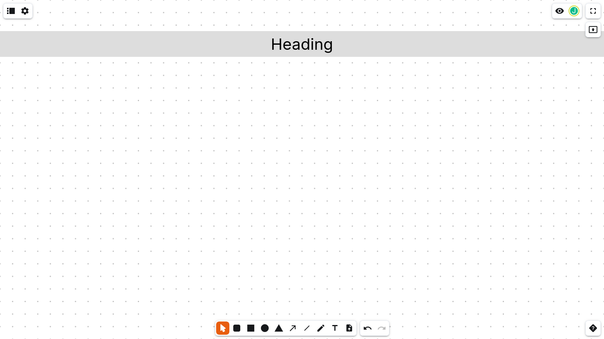

Today, I want you to experiment with some simple programming. Some ideas for NeoBoard templates are too complex to put together by hand. That's when I resort to TypeScript and some programming.

The following code runs in NodeJS, Deno and Bun.

```ts
const neoboard = {
    version: 'net.nordeck.whiteboard@v1',
    whiteboard: {
        slides: [
            {
                elements: [
                    {
                        position: { x: 0, y: 100 },
                        type: 'shape',
                        kind: 'rectangle',
                        fillColor: '#dddddd',
                        width: 1920,
                        height: 80,
                        text: "Heading",
                    },
                ],
            },
        ],
    }
};

// Convert it to JSON and print it on the terminal
console.log(JSON.stringify(neoboard));
```

It generates one slide with one rectangle at the top. The rectangle contains the text "Heading". Its width of 1920 pixels means that it will span across the entire slide. Slides are 1920 pixels wide and 1080 pixel high.



To learn more about what's possible with NeoBoards and coding, I recommend reading [Creating NeoBoards with code]({})
