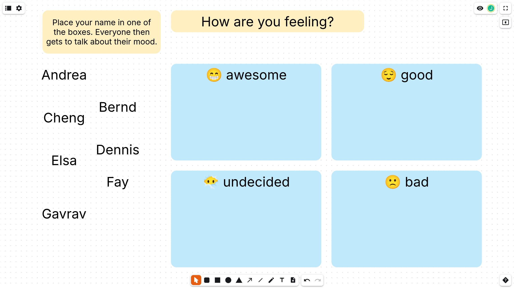

Frohen zweiten Advent!

Viele Entwicklerteams nutzen die Retrospektive um langfristige Blockaden des Teams zu vermeiden oder zu beheben.

Frag doch mal die Entwickler, wie zufrieden sie momentan sind. Bestimmt ergeben sich wertvolle Einblicke in ihre Arbeit.

[Vorlage herunterladen](./retro-checkin-mood.nwb)
