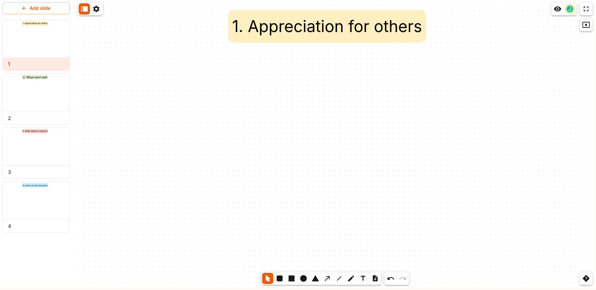

Es muss nicht immer verziert sein, wenn der Fokus auf der Arbeit liegt.

Diese vier Folien gehen ohne Ablenkung durch die 4 Basisschritte einer Retrospektive in der Softwareentwicklung:

1. Lob für andere
2. Was gut lief
3. Was besser laufen sollte
4. Maßnahmen für den nächsten Sprint

[Vorlage herunterladen](./4-step-retrospective.nwb)
