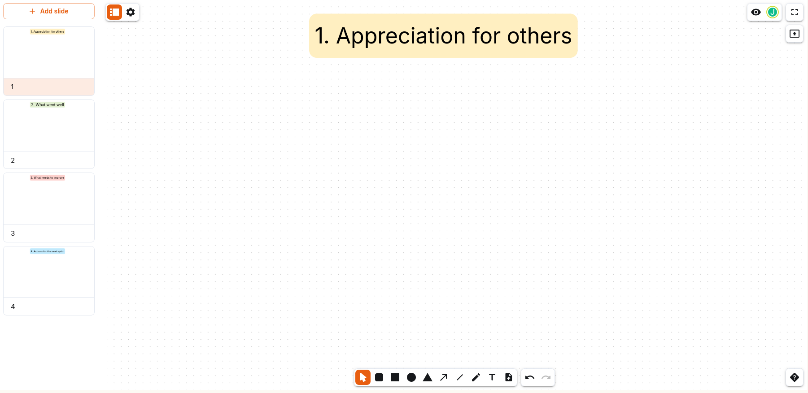

This template focuses on the basics, so your team can focus on your work.

These four slides contain just the headings for the 4 basic steps of a retrospective in agile software development.

1. Appreciation for others
2. What went well
3. What needs to change
4. Actions for the next sprint

[Download the nwb file here](./4-step-retrospective.nwb)
